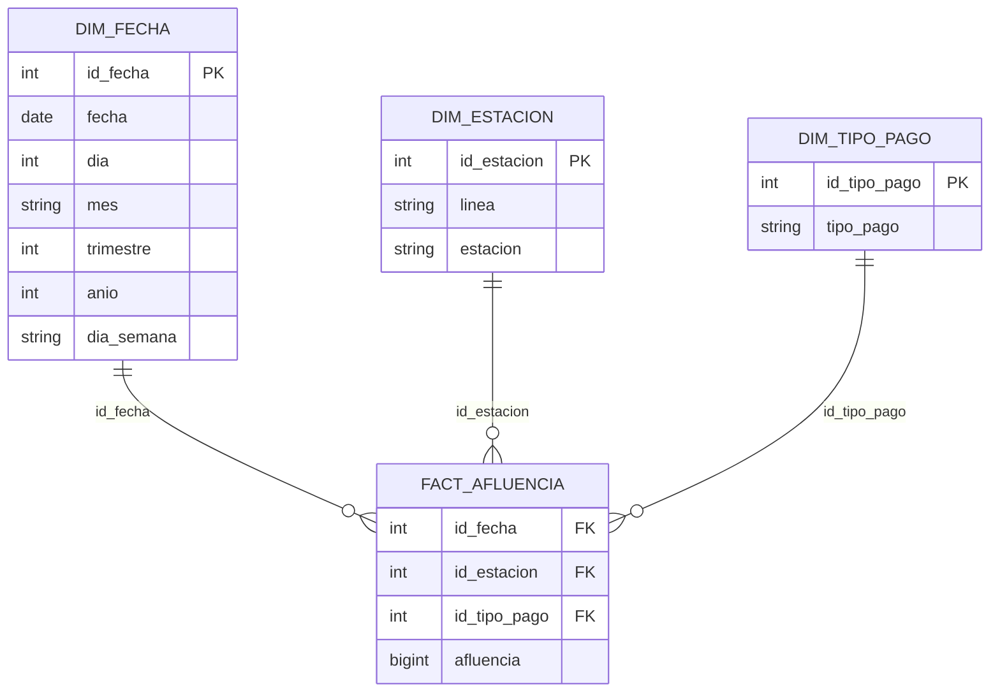

# Dashboard de Afluencia del Metro CDMX

Proyecto final del Módulo 4 del Diplomado en Business Intelligence.
El proyecto desarrolla una solución analítica completa para estudiar la afluencia de usuarios del Sistema de Transporte Colectivo Metro de la Ciudad de México mediante un modelo OLAP, consultas SQL y visualizaciones interactivas.

## Dashboard publicado

El dashboard interactivo se encuentra disponible en:

[Ver dashboard interactivo](https://marcosisaacrodriguezmoreno.github.io/Proyecto-Final-Modulo-4/)

## Repositorio del proyecto

[Repositorio en GitHub](https://github.com/MarcosIsaacRodriguezMoreno/Proyecto-Final-Modulo-4)

---

## 1. Descripción general

El Metro de la Ciudad de México es uno de los sistemas de transporte público más importantes del país. Su afluencia diaria refleja patrones de movilidad relacionados con actividades laborales, escolares, comerciales, turísticas y recreativas.

Este proyecto analiza la afluencia del Metro CDMX durante el periodo 2021-2026, considerando tanto la evolución general del sistema como diferencias por línea, estación y día de la semana.

El análisis se desarrolló a partir de un flujo de Business Intelligence que incluye:

1. Obtención de datos abiertos.
2. Procesamiento y transformación con Python.
3. Construcción de un modelo dimensional tipo estrella.
4. Carga de tablas a una base de datos PostgreSQL/Aurora en AWS.
5. Consultas SQL analíticas sobre el modelo OLAP.
6. Generación de visualizaciones interactivas con Plotly.
7. Publicación del dashboard mediante GitHub Pages.

---

## 2. Fuente de datos

Los datos utilizados provienen del Portal de Datos Abiertos de la Ciudad de México:

[Afluencia diaria del Metro CDMX](https://datos.cdmx.gob.mx/dataset/afluencia-diaria-del-metro-cdmx)

El conjunto de datos pertenece a la Secretaría de Movilidad de la Ciudad de México y contiene información de afluencia del Metro. Para este proyecto se utilizó la base desglosada, la cual permite analizar la afluencia por fecha, línea, estación y tipo de pago.

Archivo utilizado en el proyecto:

```text
afluenciastc_desglosado_04_2026.csv
```

En el repositorio se incluye el archivo comprimido:

```text
afluenciastc_desglosado_04_2026.zip
```

---

## 3. Planteamiento del problema

El periodo analizado incluye eventos que modificaron de forma importante la movilidad en la Ciudad de México:

* Regreso gradual a la movilidad cotidiana después de la pandemia.
* Permanencia de esquemas como trabajo remoto y clases en línea durante parte de 2021.
* Derrumbe del tramo elevado de la Línea 12 ocurrido el 3 de mayo de 2021.
* Reparaciones y reapertura gradual de la Línea 12.
* Modernización de la Línea 1 iniciada en 2022 y concluida en 2025.
* Alta concentración de usuarios en estaciones terminales, periféricas, de transbordo o conectadas con otros medios de transporte.

A partir de este contexto, el proyecto busca responder:

> ¿Cómo evolucionó la afluencia del Metro CDMX entre 2021 y 2026, y qué patrones se observan por línea, estación, día de la semana y eventos operativos relevantes?

---

## 4. Objetivo del proyecto

Construir un dashboard interactivo que permita analizar la afluencia del Metro CDMX desde distintas perspectivas temporales y operativas.

Los objetivos específicos son:

* Analizar la evolución mensual y diaria de la afluencia total.
* Comparar la demanda de usuarios entre líneas.
* Identificar líneas con mayor y menor presión operativa.
* Detectar patrones de movilidad por día de la semana.
* Identificar estaciones con mayor concentración de usuarios.
* Analizar la participación de cada línea en la afluencia total.
* Detectar días con afluencia atípicamente alta o baja.
* Relacionar cambios en la afluencia con eventos como pandemia, reparaciones y cierres operativos.

---

## 5. Modelo OLAP

Para el análisis se construyó un modelo dimensional tipo estrella. Este modelo permite organizar los datos en una tabla de hechos central y dimensiones descriptivas.

El grano de la tabla de hechos es:

> Afluencia registrada por fecha, estación y tipo de pago.

Esto significa que cada registro de la tabla de hechos representa la cantidad de usuarios asociada a una combinación específica de fecha, estación y tipo de pago.

---

## 6. Diagrama estrella del modelo OLAP



---

## 7. Tablas del modelo dimensional

### Tabla de hechos: `fact_afluencia`

Contiene la medida principal del análisis: la afluencia de usuarios.

| Campo          |         Tipo | Descripción                           |
| -------------- | -----------: | ------------------------------------- |
| `id_fecha`     |       Entero | Llave hacia la dimensión fecha        |
| `id_estacion`  |       Entero | Llave hacia la dimensión estación     |
| `id_tipo_pago` |       Entero | Llave hacia la dimensión tipo de pago |
| `afluencia`    | Entero largo | Número de usuarios registrados        |

### Dimensión fecha: `dim_fecha`

Contiene atributos temporales para analizar la afluencia por día, mes, trimestre y año.

| Campo        |   Tipo | Descripción                                  |
| ------------ | -----: | -------------------------------------------- |
| `id_fecha`   | Entero | Identificador de fecha en formato `YYYYMMDD` |
| `fecha`      |  Fecha | Fecha calendario                             |
| `dia`        | Entero | Día del mes                                  |
| `mes`        |  Texto | Mes                                          |
| `trimestre`  | Entero | Trimestre                                    |
| `anio`       | Entero | Año                                          |
| `dia_semana` |  Texto | Día de la semana                             |

### Dimensión estación: `dim_estacion`

Contiene la información de las estaciones y sus líneas.

| Campo         |   Tipo | Descripción                     |
| ------------- | -----: | ------------------------------- |
| `id_estacion` | Entero | Identificador único de estación |
| `linea`       |  Texto | Línea del Metro                 |
| `estacion`    |  Texto | Nombre de la estación           |

### Dimensión tipo de pago: `dim_tipo_pago`

Contiene los medios o categorías de acceso.

| Campo          |   Tipo | Descripción                    |
| -------------- | -----: | ------------------------------ |
| `id_tipo_pago` | Entero | Identificador del tipo de pago |
| `tipo_pago`    |  Texto | Tipo de pago o medio de acceso |

---

## 8. Implementación en AWS

El modelo dimensional se cargó en una base de datos PostgreSQL alojada en Amazon Aurora.

Se utilizó el esquema:

```text
metro_dwh_py
```

Tablas cargadas en la base OLAP:

```text
metro_dwh_py.dim_fecha
metro_dwh_py.dim_estacion
metro_dwh_py.dim_tipo_pago
metro_dwh_py.fact_afluencia
```

La conexión se realizó desde Python mediante `SQLAlchemy` y el conector `psycopg2`, permitiendo crear el esquema, cargar las tablas y ejecutar consultas SQL analíticas sobre el modelo dimensional.

---

## 9. Proceso ETL

El proceso ETL fue desarrollado en Python dentro del notebook del proyecto.

Archivo principal:

```text
proyecto_final.ipynb
```

### 9.1 Extracción

La extracción parte del archivo CSV descargado del Portal de Datos Abiertos de la Ciudad de México.

```python
metro = pd.read_csv("afluenciastc_desglosado_04_2026.csv")
```

### 9.2 Transformación

Las principales transformaciones realizadas fueron:

* Conversión de la columna `fecha` a tipo datetime.
* Creación de la dimensión fecha.
* Creación de la dimensión estación.
* Creación de la dimensión tipo de pago.
* Generación de identificadores para las dimensiones.
* Construcción de la tabla de hechos.
* Relación de la tabla de hechos con las dimensiones mediante llaves.
* Selección de campos finales para cada tabla dimensional.

La dimensión fecha se generó a partir de las columnas temporales del dataset y se enriqueció con:

* Día.
* Mes.
* Trimestre.
* Año.
* Día de la semana.
* Identificador `id_fecha` en formato `YYYYMMDD`.

La dimensión estación se generó a partir de las combinaciones únicas de línea y estación.

La dimensión tipo de pago se generó a partir de los valores únicos de la columna `tipo_pago`.

La tabla de hechos se construyó relacionando el dataset original con las dimensiones y conservando la medida `afluencia`.

### 9.3 Carga

Las tablas resultantes se cargaron en PostgreSQL/Aurora con `pandas.to_sql()` dentro del esquema `metro_dwh_py`.

Tablas cargadas:

```text
dim_fecha
dim_estacion
dim_tipo_pago
fact_afluencia
```

También se exportaron archivos CSV derivados del modelo dimensional:

```text
dim_fecha.csv
dim_estacion.csv
dim_tipo_pago.csv
fact_afluencia.csv
```

---

## 10. Consultas SQL analíticas

Las gráficas del dashboard se generaron a partir de consultas SQL sobre el modelo OLAP.

Las consultas utilizan:

* `JOIN` entre tabla de hechos y dimensiones.
* Agregaciones con `SUM` y `AVG`.
* Agrupaciones con `GROUP BY`.
* Ordenamientos con `ORDER BY`.
* Funciones de fecha.
* CTEs para agregaciones intermedias.

Ejemplo de consulta analítica usada para calcular el promedio diario por línea y día de la semana:

```sql
WITH diario_linea AS (
    SELECT
        d.fecha,
        d.dia_semana,
        e.linea,
        SUM(f.afluencia) AS afluencia_diaria
    FROM metro_dwh_py.fact_afluencia f
    INNER JOIN metro_dwh_py.dim_fecha d
        ON f.id_fecha = d.id_fecha
    INNER JOIN metro_dwh_py.dim_estacion e
        ON f.id_estacion = e.id_estacion
    GROUP BY
        d.fecha,
        d.dia_semana,
        e.linea
)
SELECT
    linea,
    dia_semana,
    AVG(afluencia_diaria) AS afluencia
FROM diario_linea
GROUP BY
    linea,
    dia_semana
ORDER BY
    linea,
    dia_semana;
```

Este tipo de consulta evita promediar directamente registros desagregados por tipo de pago y permite calcular correctamente la afluencia diaria agregada por línea.

---

## 11. Generación de visualizaciones

Las visualizaciones fueron desarrolladas con Plotly en Python.

Cada gráfica se generó a partir de un DataFrame producido por una consulta SQL sobre la base OLAP. Posteriormente, cada figura fue exportada como archivo HTML interactivo mediante:

```python
fig.write_html(
    "graficas/nombre_grafica.html",
    include_plotlyjs="cdn",
    full_html=True
)
```

Las visualizaciones fueron integradas en el archivo `index.html` mediante `iframe`.

---

## 12. Dashboard interactivo

El dashboard fue construido en HTML y CSS, con un diseño oscuro en tonos negros y naranjas.

Archivo principal:

```text
index.html
```

El dashboard incluye:

* Portada del proyecto.
* Descripción general.
* Tarjetas resumen.
* Explicación sobre el uso de gráficas interactivas.
* Índice de navegación.
* Doce gráficas interactivas embebidas.
* Interpretación analítica para cada gráfica.
* Diseño responsivo para diferentes tamaños de pantalla.

---

## 13. Visualizaciones incluidas

El dashboard contiene 12 visualizaciones:

1. **Afluencia mensual total del Metro**
   Muestra la evolución mensual agregada de usuarios en toda la red.

2. **Afluencia mensual por línea**
   Compara el comportamiento mensual de cada línea.

3. **Promedio diario de usuarios por línea**
   Identifica las líneas con mayor carga promedio diaria.

4. **Promedio de usuarios por línea y día de la semana**
   Muestra patrones semanales de uso para cada línea.

5. **Top 15 estaciones con mayor afluencia promedio diaria**
   Identifica estaciones terminales, periféricas, de transbordo o de alta conexión.

6. **Afluencia total por año y mes**
   Permite analizar la estacionalidad y evolución mensual por año.

7. **Distribución de afluencia diaria por línea**
   Muestra la variabilidad diaria de usuarios en cada línea mediante boxplots.

8. **Participación de afluencia total por línea**
   Presenta la contribución acumulada de cada línea al total del sistema.

9. **Evolución mensual de afluencia por línea**
   Muestra series individuales para cada línea en formato de mosaico.

10. **Afluencia diaria total del Metro**
    Muestra el comportamiento diario de toda la red.

11. **Promedio de afluencia por día de la semana**
    Compara la afluencia promedio por día.

12. **Días atípicos de afluencia total**
    Identifica días con afluencia inusualmente alta o baja.

---

## 14. Interactividad del dashboard

Las gráficas interactivas permiten:

* Consultar valores exactos al pasar el cursor.
* Hacer zoom en rangos específicos.
* Desplazarse dentro de la visualización.
* Activar o desactivar elementos desde la leyenda.
* Descargar la gráfica como imagen.
* Explorar patrones directamente desde el navegador.

---

## 15. Estructura del repositorio

```text
Proyecto-Final-Modulo-4/
│
├── index.html
├── proyecto_final.ipynb
├── afluenciastc_desglosado_04_2026.zip
├── dim_fecha.csv
├── dim_estacion.csv
├── dim_tipo_pago.csv
├── fact_afluencia.csv
│
└── graficas/
    ├── 01_afluencia_mensual_total.html
    ├── 02_afluencia_mensual_por_linea.html
    ├── 03_promedio_diario_por_linea.html
    ├── 04_heatmap_linea_dia.html
    ├── 05_top_estaciones.html
    ├── 06_heatmap_anio_mes.html
    ├── 07_boxplot_linea.html
    ├── 08_treemap_linea.html
    ├── 09_mosaico_linea.html
    ├── 10_afluencia_diaria_total.html
    ├── 11_promedio_dia_semana.html
    └── 12_dias_atipicos.html
```

---

## 16. Flujo general del proyecto

```text
Datos abiertos CDMX
        ↓
Carga del CSV con Python
        ↓
Limpieza y transformación
        ↓
Creación de dimensiones
        ↓
Creación de tabla de hechos
        ↓
Carga del modelo OLAP en AWS
        ↓
Consultas SQL analíticas
        ↓
DataFrames agregados
        ↓
Gráficas interactivas con Plotly
        ↓
Exportación a HTML
        ↓
Integración en dashboard web
        ↓
Publicación con GitHub Pages
```

---

## 17. Cómo ejecutar el proyecto

### 17.1 Clonar el repositorio

```bash
git clone https://github.com/MarcosIsaacRodriguezMoreno/Proyecto-Final-Modulo-4.git
cd Proyecto-Final-Modulo-4
```

### 17.2 Instalar dependencias

```bash
pip install pandas sqlalchemy psycopg2-binary plotly pyarrow
```

### 17.3 Abrir el notebook

Abrir el archivo:

```text
proyecto_final.ipynb
```

Ejecutar las celdas en orden para:

1. Cargar los datos.
2. Crear las dimensiones.
3. Crear la tabla de hechos.
4. Cargar el modelo a PostgreSQL/Aurora.
5. Ejecutar consultas SQL.
6. Generar las gráficas.
7. Exportar las visualizaciones HTML.

### 17.4 Abrir el dashboard localmente

Abrir el archivo:

```text
index.html
```

en un navegador web.

### 17.5 Consultar el dashboard publicado

El dashboard está disponible en:

```text
https://marcosisaacrodriguezmoreno.github.io/Proyecto-Final-Modulo-4/
```

---

## 18. Resultados principales

El análisis muestra una recuperación progresiva de la afluencia del Metro entre 2021 y 2026. Los niveles bajos observados al inicio del periodo se relacionan con el regreso gradual a la movilidad después de la pandemia, cuando todavía existían medidas como trabajo remoto, clases en línea y menor actividad presencial.

Las líneas con mayor demanda son la Línea 2 y la Línea 3, tanto en promedio diario como en participación acumulada. También destacan la Línea B y la Línea 8 como corredores relevantes dentro de la red.

La Línea 12 muestra una caída marcada después del derrumbe ocurrido el 3 de mayo de 2021, seguida de una recuperación posterior asociada a la reapertura gradual de sus tramos. Por su parte, la Línea 1 presenta reducciones importantes relacionadas con su proceso de modernización iniciado en 2022 y concluido en 2025.

El análisis semanal muestra que la mayor afluencia ocurre entre semana, especialmente de martes a viernes, mientras que el domingo registra el menor promedio de usuarios. Esto confirma que la demanda del Metro está fuertemente asociada con patrones de movilidad laboral y escolar.

En el ranking de estaciones destacan principalmente estaciones terminales, periféricas, de transbordo o de conexión con otros medios de transporte, como Constitución de 1917, Indios Verdes, Cuatro Caminos, Tasqueña, Pantitlán y Tacubaya.

---

## 19. Conclusión

El proyecto integra un flujo completo de Business Intelligence aplicado a datos de movilidad urbana.

La construcción del modelo dimensional permitió organizar la información de forma adecuada para analizar la afluencia desde diferentes perspectivas. Las consultas SQL sobre el modelo OLAP permitieron generar agregaciones relevantes para responder la pregunta analítica del proyecto.

El dashboard final permite identificar tendencias generales, patrones semanales, diferencias entre líneas, estaciones clave y días atípicos. En conjunto, el análisis muestra cómo la movilidad en el Metro CDMX se recuperó después de la pandemia y cómo eventos operativos específicos afectaron la afluencia de ciertas líneas.

Este proyecto combina extracción, transformación, carga, modelado OLAP, análisis SQL, visualización interactiva y publicación web en una solución integrada de Business Intelligence.

---

## 20. Tecnologías utilizadas

* Python
* Pandas
* SQLAlchemy
* PostgreSQL
* Amazon Aurora
* Plotly
* HTML
* CSS
* GitHub Pages
* Jupyter Notebook

---

## 21. Autor

**Marcos Isaac Rodríguez Moreno**

Proyecto Final
Módulo 4
Diplomado en AWS
